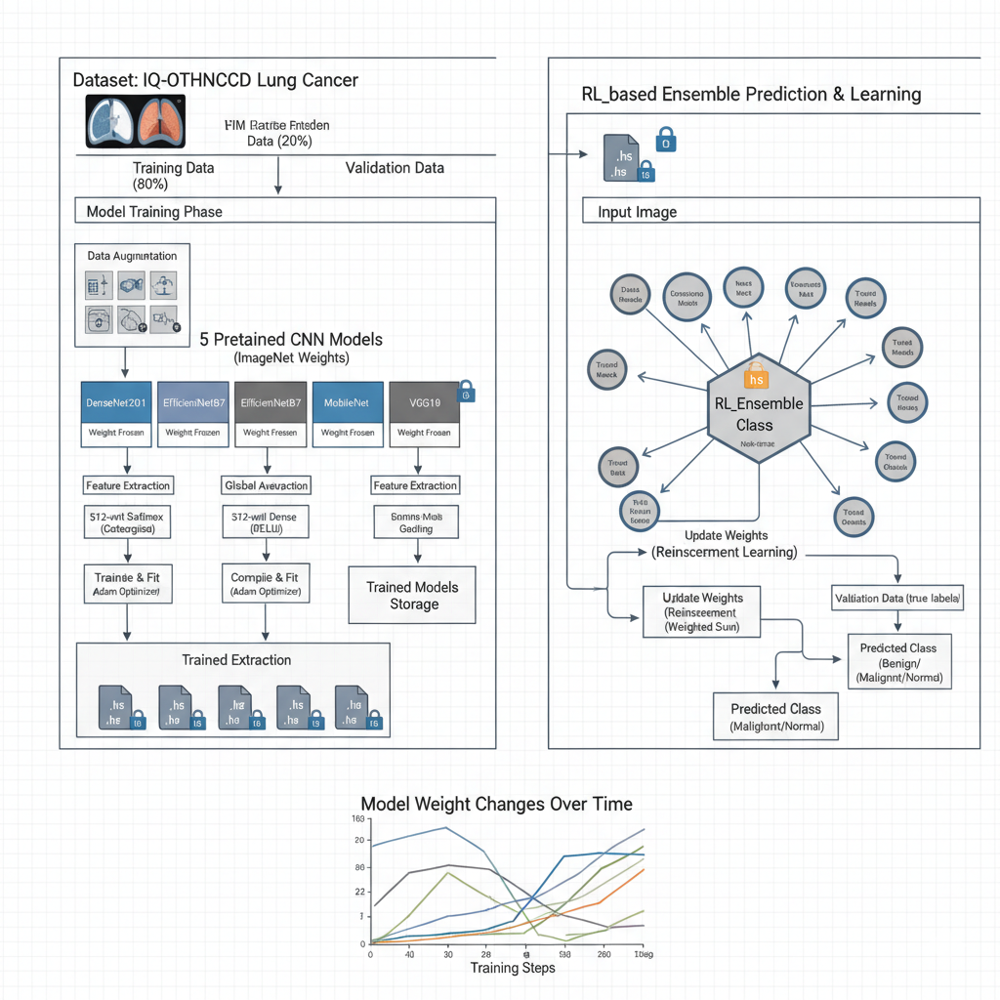

# Lung Cancer Classification using CNN Ensemble + Reinforcement Learning

This project implements a **multi-CNN ensemble system** combined with a **Reinforcement Learning (Q-learning) agent** to classify lung CT images into:

- **Benign**
- **Malignant**
- **Normal**

The ensemble includes **five pretrained CNNs**, and the RL agent dynamically learns optimal weights to improve overall performance.

This solution aligns with advanced AI for healthcare, agentic workflows, and ensemble modeling.

---

# 📊 Dataset

**IQ-OTHNCCD Lung Cancer Dataset**  
Kaggle: https://www.kaggle.com/datasets  
(Place your specific link here)

- **878 Training Images**
- **219 Validation Images**
- **3 Classes**: Benign, Malignant, Normal  

Preprocessing includes: resize → normalize → augmentation.

---

# 🧠 System Architecture

### ✔ Version (Final architecture used)


---

# 🧮 Ensemble + RL Agent Workflow

Five pretrained models are used:

- DenseNet201  
- EfficientNetB7  
- VGG16  
- VGG19  
- MobileNet  

Each produces a prediction → RL Agent learns weights → Final Ensemble Output.

---

# 📈 RL Agent Weight Evolution


This graph shows how the RL agent updates weights across training episodes.

---

# 🧩 Folder Structure

```
lung-cancer-ensemble-RL/
│
├── lung_cancer_project.ipynb
├── README.md
├── requirements.txt
│
├── models/                 <-- EMPTY FOLDER
│                           <-- Download models from Kaggle notebook
│
├── results/
│     └── __results___0_3.png
│
└── assets/
      └── Architrcture.png
```

---

# 📁 Models Folder (IMPORTANT)

### The `models/` folder is intentionally **EMPTY** in GitHub  
because `.h5` model files exceed GitHub’s 100MB limit.

### ✅ Download All Model Files Here:  
👉 **[Your Kaggle Notebook Link]**  
(Place your Kaggle notebook link here)

The following models must be downloaded:

- `DenseNet201_model.h5`  
- `EfficientNetB7_model.h5`  
- `MobileNet_model.h5`  
- `VGG16_model.h5`  
- `VGG19_model.h5`  

Place them in:

```
models/
```

---

# 🔧 Tech Stack

- Python  
- TensorFlow / Keras  
- NumPy  
- Matplotlib  
- Scikit-learn  
- Reinforcement Learning (Q-learning)

---

# ⚙️ Installation

```
pip install -r requirements.txt
```

---

# ▶️ Running Inference

```python
from tensorflow.keras.models import load_model
import numpy as np
from PIL import Image

model = load_model("models/VGG16_model.h5")

img = Image.open("test.jpg").resize((224,224))
img = np.expand_dims(np.array(img) / 255.0, axis=0)

pred = model.predict(img)
print(pred)
```

---

# 🧬 Training Summary

| Model            | Train Acc | Val Acc |
|------------------|-----------|---------|
| DenseNet201      | 94.66%    | 79.00% |
| EfficientNetB7   | 48%       | 51%    |
| VGG16            | 84.97%    | 81.74% |
| MobileNet        | 97.18%    | 86.76% |
| VGG19            | 82.07%    | 76.71% |

RL assigns higher weight to better models.

---

# 🌟 Future Improvements

- Grad-CAM explainability  
- FastAPI/AWS deployment  
- Integration with agentic medical workflow  
- LLM-based automatic report generation  

---

# 👤 Author  
**Rajdeep Singh Rathore**  

Feel free to fork, report issues, or contribute!
